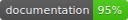

# RADAttribution iOS SDK

[](https://rakuten-advertising-developers.github.io/attribution-sdk-ios/)
## Requirements

- iOS 10.0+
- Xcode 11+
- Swift 5+
- Ruby ([Installation Guide](./RubyInstallationGuide.md))
- [CocoaPods](https://cocoapods.org) 1.9.0+
```sh 
gem install cocoapods 
```
## Documentation
* [API References](https://rakuten-advertising-developers.github.io/attribution-sdk-ios/)

## Demo projects
* [RAd Advertiser Demo](https://github.com/Rakuten-Advertising-Developers/radadvertiser-demo-ios/)
* [RAd Publisher Demo](https://github.com/Rakuten-Advertising-Developers/radpublisher-demo-ios)

## Example
To run the example project, clone the repo, and run `pod install` from the Example directory first.

## Installation
RADAttribution is available through [CocoaPods](https://cocoapods.org) as private pod. To install
it, add the following line to your Podfile:

```ruby
source 'https://github.com/CocoaPods/Specs.git'
source 'https://github.com/Rakuten-Advertising-Developers/Specs.git'

target 'YOUR_TARGET_NAME' do
  
  use_frameworks!
  pod 'RADAttribution'
  
end
```
## Usage
> All examples require `import RADAttribution` somewhere in the source file.

#### Resolving links
RADAttribution provides ability to resolve links from Publisher applications, `RADAttribution.shared.linkResolver` property is responsible for this process. In your AppDelegate use:
```swift
func application(_ application: UIApplication, continue userActivity: NSUserActivity, restorationHandler: @escaping ([UIUserActivityRestoring]?) -> Void) -> Bool {
       
    let resolved = RADAttribution.shared.linkResolver.resolve(userActivity: userActivity)
    if resolved {
        //success case handling
    } else {
        //error case handling
    }
    return true
}
```
Optionally you can use `delegate` property of `linkResolver`, to track statuses of the process
```swift
let vc = ViewController()
RADAttribution.shared.linkResolver.delegate = viewController
navigationController?.pushViewController(vc, animated: true)
```
In that case, you must confirm `LinkResolvableDelegate` in the place where you would like to receive statuses
```swift
extension ViewController: LinkResolvableDelegate {
    
    func didResolve(link: String, resultMessage: String) {
        DispatchQueue.main.async { [weak self] in
            //success case handling
        }
    }
    
    func didFailedResolve(link: String, with error: Error) {
        DispatchQueue.main.async { [weak self] in
            //error case handling
        }
    }
}
```
#### Send Events
Another option of RADAttribution is ability to send events. `RADAttribution.shared.eventSender` property is responsible for this purpose. To send your events, use the following code. (optionally you can pass additional information with `EventData` struct)
```swift
RADAttribution.shared.eventSender.sendEvent(name: "YOUR_EVENT_NAME", eventData: nil)
```
Similarly, you can use `delegate` property of `eventSender`, to track statuses of sending events
```swift
let vc = ViewController()
RADAttribution.shared.eventSender.delegate = viewController
navigationController?.pushViewController(vc, animated: true)
```
Confirm to `EventSenderableDelegate` in a place where you would like to receive statuses
```swift
extension ViewController: EventSenderableDelegate {
    
    func didSend(eventName: String, resultMessage: String) {
        DispatchQueue.main.async { [weak self] in
            //success case handling
        }
    }
    
    func didFailedSend(eventName: String, with error: Error) {
        DispatchQueue.main.async { [weak self] in
            //error case handling
        }
    }
}
```
#### Logging
For debugging purpose you can enable network logs. `RADAttribution.shared.logger` property is responsible for this process.
```swift
RADAttribution.shared.logger.enabled = true
```

## Author
Rakuten Advertising

## License
RADAttribution iOS SDK is available under the MIT license. See the [LICENSE](./LICENSE) file for more info.
